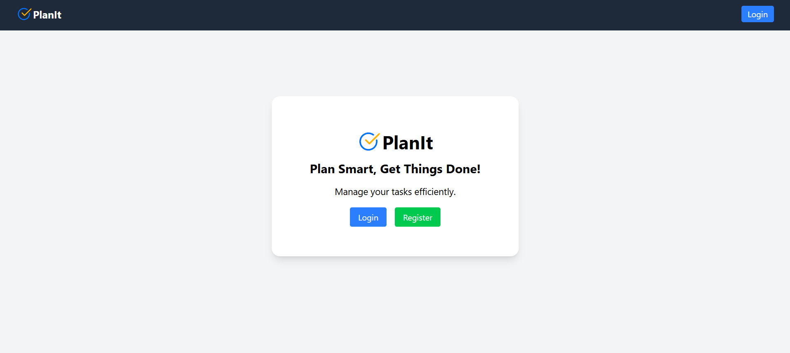
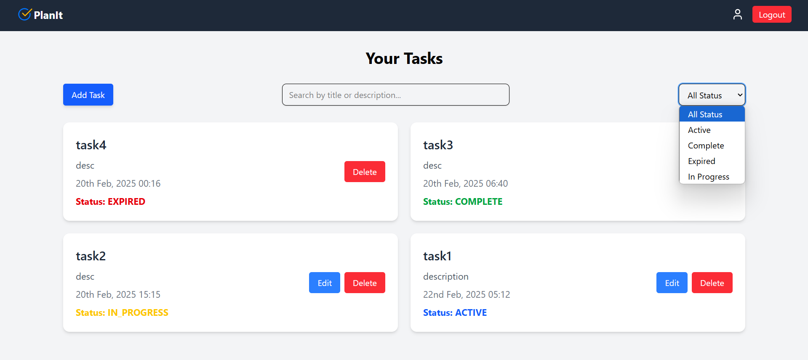

# PlanIt ToDo App

PlanIt is a **MERN-based** task management application that helps users organize, track, and manage their to-do lists efficiently.

## 🚀 Live Demo

- **Live**: [Link](https://planit-frontend-swart.vercel.app)

## 🛠️ Tech Stack

- **Frontend**: React, Redux Toolkit, React Router, Tailwind CSS, Axios, React Toastify
- **Backend**: Node.js, Express.js, MongoDB, Mongoose, JWT Authentication, bcrypt
- **Deployment**: Backend on Render and Frontend on Vercel

## 📂 Folder Structure

```
PlanIt-ToDo-App/
│── backend/        # Backend code (Node.js, Express)
│── frontend/       # Frontend code (React, Redux, Tailwind)
│── README.md       # Documentation
```

## ⚡ Features

- User Authentication (Signup/Login)
- Create, Update, Delete, and Manage Tasks
- Password Reset (via current password & reset link)
- Task Filtering & Searching
- Task Status Management (Active, In Progress, Completed, Expired)
- Automated Email Reminders
- Responsive UI with Tailwind CSS
- Secure API using JWT Authentication

## 📸 Screenshots

### 🏠 Homepage



### 📝 Task Management



## 📌 Installation

1. **Clone the repository**:

   ```bash
   git clone https://github.com/shubhpatel32/PlanIt-ToDo-App.git
   cd PlanIt-ToDo-App
   ```

2. **Backend Setup**:

   ```bash
   cd backend
   npm install
   npm start  # Runs the backend on http://localhost:5000
   ```

3. **Frontend Setup**:
   ```bash
   cd frontend
   npm install
   npm run dev  # Runs the frontend on http://localhost:5173
   ```

## ⚙️ Environment Variables (.env)

Create a `.env` file in the **backend** folder and add:

```env
MONGO_URI=your_mongodb_uri
JWT_SECRET=your_jwt_secret
FRONTEND_URL=your_frontend_url
PORT=5000
```

Create a `.env` file in the **frontend** folder and add:

```env
VITE_API_URL=your_backend_url
```

## 📡 API Endpoints

| Method | Endpoint                  | Description                 |
| ------ | ------------------------- | --------------------------- |
| POST   | /api/auth/signup          | User Registration           |
| POST   | /api/auth/login           | User Login                  |
| POST   | /api/auth/forgot-password | Request Password Reset Link |
| POST   | /api/auth/reset-password/:token  | Reset Password Using Link   |
| PUT    | /api/auth/update-password | Change Password Using Current|
| GET    | /api/todos                | Get All Todos               |
| POST   | /api/todos                | Create a New Todo           |
| PUT    | /api/todos/:id            | Update a Todo               |
| DELETE | /api/todos/:id            | Delete a Todo               |
| GET    | /api/run-cron             | To Run Cron                 |


## 🎯 Author

- **Shubh Patel**
